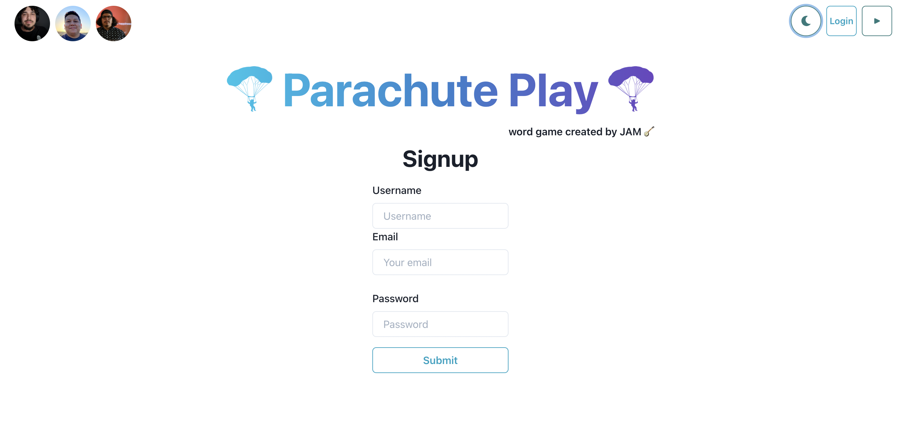
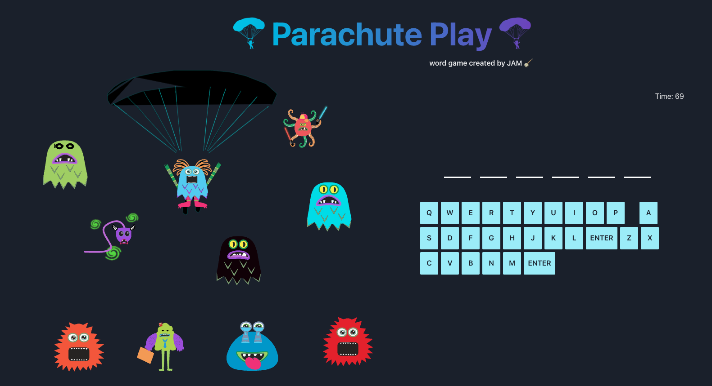

# Parachute Play
- `Word game created by Team JAM 🪕`

## Meet The Team
- [Jesse Hernandez - Front-End 📺](https://github.com/jessebubble)
- [Adam Castro - Back-End 💾](https://github.com/avc0021)
- [Mike Bashford - The Wizard 🧙](https://github.com/mikebashford)

## Description
- `Word Game built using the MERN Stack`
* [View Team Project](https://jam-group-project.herokuapp.com/)

## Technology 
- `React` for the front end.
- GraphQL with a `Node.js` and `Express.js` server.
- `MongoDB` and the Mongoose ODM for the database.

## Resources
* [Create React App](https://reactjs.org/docs/create-a-new-react-app.html)
* [Node.js/Express.js server and API](https://expressjs.com/)
* [Apollo/GraphQL](https://www.apollographql.com/docs/react/)
* [MongoDB Atlas](https://www.mongodb.com/atlas)
* [Deploy to Heroku](https://www.heroku.com/)
* [Chakra-UI](https://chakra-ui.com)
* [Figma](https://www.figma.com/)
* [Styled Components](https://styled-components.com)
* [Fireship Youtube](https://youtu.be/emFMHH2Bfvo)

## Sample

